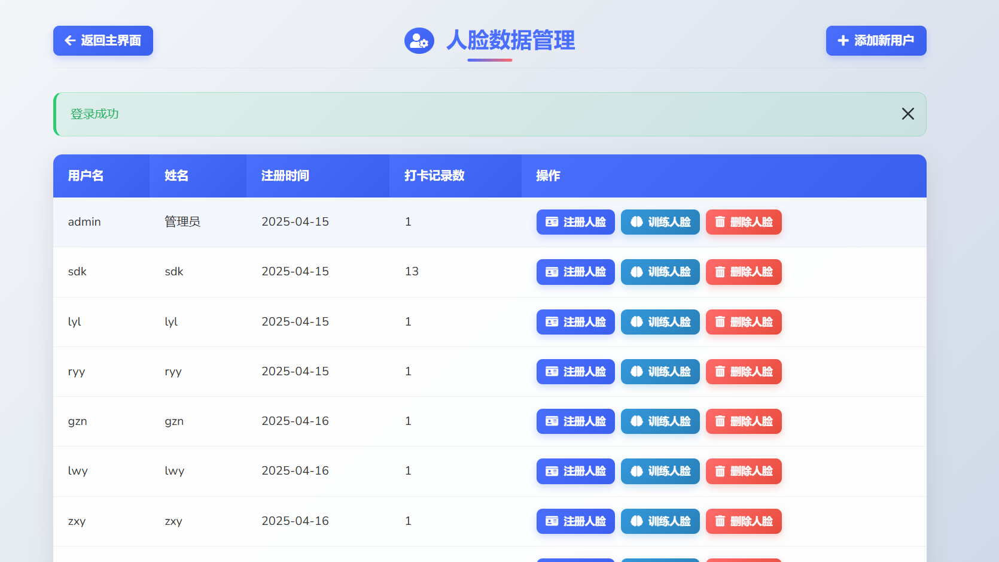
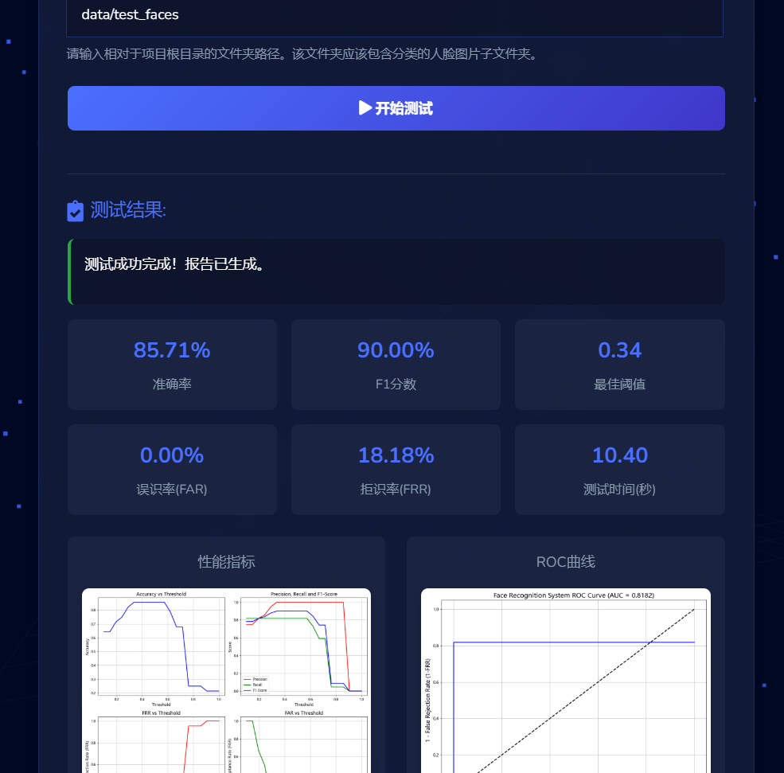

# 基于人脸识别的考勤系统

本项目是一个使用Python、Flask和深度学习技术开发的人脸识别考勤系统。系统通过摄像头捕获人脸图像，与数据库中存储的人脸特征进行比对，自动完成考勤记录，并提供人脸识别性能测试和评估功能。

## 技术栈

- **后端**：Python、Flask
- **数据库**：MySQL
- **人脸识别**：OpenCV、dlib、face_recognition
- **前端**：HTML、CSS、JavaScript、Bootstrap、Three.js
- **数据可视化**：Chart.js
- **性能评估**：Scikit-learn、Matplotlib

## 功能特点

- **基础功能**：
  - 人脸采集与注册
  - 实时人脸识别考勤（签到/签退）
  - 考勤记录管理与统计
  - 用户管理（管理员/普通用户）
  - 数据可视化展示

- **高级功能**：
  - 3D粒子动态背景效果
  - 人脸识别性能测试与评估
  - 随机图片识别测试
  - 自适应界面设计
  - 情绪识别功能
  - 详细的性能指标分析（ROC曲线、准确率、F1分数等）

## 系统截图

### 登录界面
使用现代化设计的登录界面，支持用户认证和角色管理。


### 管理员仪表盘
管理员可以查看系统概况、管理用户和访问高级功能。


### 考勤统计页面
使用图表直观展示考勤数据和趋势分析。


### 人脸识别界面
实时摄像头捕获和人脸识别功能。


### 人员管理界面
管理系统用户和他们的人脸数据。



### 性能测试界面
测试系统的识别速度、准确率和其他性能指标。


### 随机图片测试界面
使用随机图片评估人脸识别系统的性能。



## 模型下载

由于GitHub对文件大小的限制，本项目的模型文件需要单独下载：

- **dlib人脸识别模型**：
  - 百度网盘链接：[待补充]
  - 提取码：[待补充]
- **情绪识别模型**：
  - 百度网盘链接：[待补充]
  - 提取码：[待补充]

下载完成后，请将模型文件放置在项目的对应目录中：
- dlib模型文件放置在 `data/data_dlib/` 目录
- 情绪识别模型放置在 `FER2013_VGG19/` 目录

## 安装步骤

1. 克隆项目到本地：
   ```
   git clone https://github.com/yourusername/Face-Recognition-Based-Attendance-System.git
   ```

2. 安装所需依赖包：
   ```
   pip install -r requirements.txt
   ```

3. 下载模型文件并放置到正确位置（见上方"模型下载"部分）

4. 配置MySQL数据库：
   - 创建数据库：`attendance_db`
   - 导入数据库结构：`mysql -u username -p attendance_db < database.sql`
   - 修改`db_config.py`中的数据库连接参数

5. 创建测试图片目录（可选）：
   ```
   mkdir -p data/test_faces
   ```
   将测试图片按类别放置在子文件夹中，用于性能评估。

## 使用方法

1. 启动Web应用：
   ```
   python app.py
   ```
   通过浏览器访问`http://localhost:5000`进入系统。

2. 管理员功能：
   - 用户管理：添加、编辑和删除用户
   - 考勤统计：查看和导出考勤报表
   - 性能测试：测试识别速度、准确率等指标
   - 随机图片测试：使用测试集评估系统性能

3. 普通用户功能：
   - 人脸签到/签退
   - 查看个人考勤记录
   - 个人信息管理

## 系统架构

系统采用MVC架构设计：
- **Model层**：处理数据和业务逻辑，包括数据库操作和人脸识别算法
- **View层**：负责用户界面展示，包括HTML模板和静态资源
- **Controller层**：处理用户请求，连接Model和View层

### 组件说明：
- `face_recognition_evaluator.py`：提供人脸识别性能评估功能
- `emotion_recognizer.py`：实现表情识别功能
- `attendance_taker.py`：核心人脸识别与考勤处理模块
- `app.py`：Flask应用主程序和路由定义
- `static/js/3d-background.js`：实现3D粒子背景效果

## 技术特色

1. **自适应性能优化**：
   - 根据设备性能自动调整3D效果和粒子数量
   - 针对不同硬件平台优化渲染性能

2. **科学评估方法**：
   - 使用ROC曲线分析识别阈值
   - 计算准确率、精确率、召回率、F1分数等多维指标

3. **现代化界面设计**：
   - 响应式布局适配各种设备
   - 3D粒子背景增强视觉体验
   - 数据可视化直观展示考勤数据

## 未来计划

- 添加深度学习模型训练界面
- 集成更多生物识别方式（如虹膜识别）
- 开发移动应用版本
- 支持更多数据库类型

## 贡献指南

欢迎贡献代码或提出建议！您可以：
- 提交Pull Request
- 创建Issue报告bug或提出新功能建议
- 完善文档


# face_recoginition-
